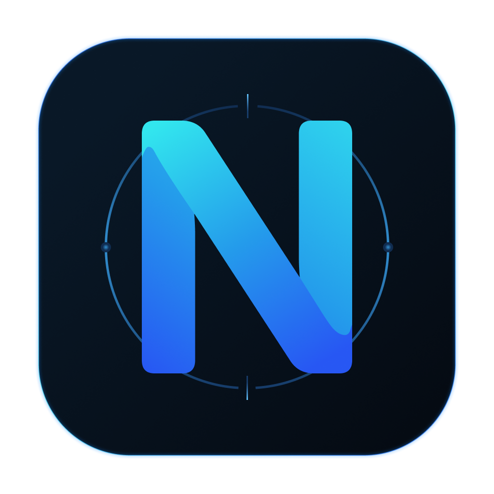

# Neyra

<div align="center">
  
</div>

**A lightweight, cross-platform desktop Git client with a modern
interface.**

[**Download latest
release**](https://github.com/SeventhFret/neyra/releases/latest) ·
[Report an issue](https://github.com/SeventhFret/neyra/issues)

---

## About

Neyra is a desktop Git client focused on making everyday repository
operations fast and accessible without hiding Git itself behind an
overly complex interface.

It is built with Tauri and Rust on the backend and React + TypeScript on
the frontend.

> **Neyra is currently an early-stage project.** Features, UI, and
> internal APIs may change as development continues.

## Screenshot


## Features

- Open Git repositories and quickly return to recently used
  repositories
- View repository status and changed files
- Stage and unstage files
- Create commits
- Push changes, including force-with-lease
- Fetch and pull from remotes
- Pull with rebase
- Browse local and remote branches
- Switch and create branches
- Rebase branches
- Browse commit history
- View and edit Git user configuration
- Automatic repository change detection
- Keyboard shortcuts for common actions
- In-app notifications
- Built-in application updates

## Downloads

Prebuilt releases are available from [GitHub
Releases](https://github.com/SeventhFret/neyra/releases/latest).

Platform Architecture Support

---

macOS Apple Silicon (arm64) Supported
Windows x86-64 Supported
Linux x86-64 Supported

### macOS

Download the `.dmg` from the latest release.

Neyra is currently distributed without Apple notarization. macOS may
therefore display a security warning when opening it for the first time.

### Windows

Download the Windows installer from the latest release.

### Linux

Download the appropriate Linux package from the latest release.

## Keyboard shortcuts

Neyra is designed to be usable without constantly reaching for the
mouse. Common repository actions and navigation tabs have keyboard
shortcuts displayed directly in the interface.

On macOS, shortcuts use **⌘ Cmd**. On Windows and Linux, the
corresponding shortcuts use **Ctrl**.

## Development

### Prerequisites

To build Neyra locally, you will need:

- [Node.js](https://nodejs.org/)
- [Rust](https://www.rust-lang.org/tools/install)
- [Git](https://git-scm.com/)
- The platform-specific prerequisites required by
  [Tauri](https://v2.tauri.app/start/prerequisites/)

Clone the repository:

```bash
git clone https://github.com/SeventhFret/neyra.git
cd neyra
```

Install frontend dependencies:

```bash
npm install
```

Run the application in development mode:

```bash
npx tauri dev
```

Build a release:

```bash
npx tauri build
```

## Tech stack

- **Desktop runtime:** Tauri
- **Backend:** Rust
- **Git integration:** git2
- **Frontend:** React + TypeScript
- **UI:** Mantine
- **State management:** Zustand
- **Animations:** Motion

## Project status

Neyra is under active development. The current releases are suitable for
testing and everyday use, but the project has not reached a stable `1.0`
release yet.

Bug reports, feature requests, and contributions are welcome through
[GitHub Issues](https://github.com/SeventhFret/neyra/issues).

## License

Neyra is released under the [MIT License](LICENSE.md).
